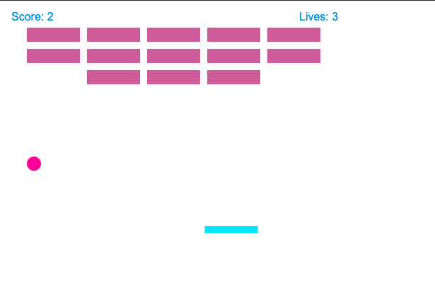
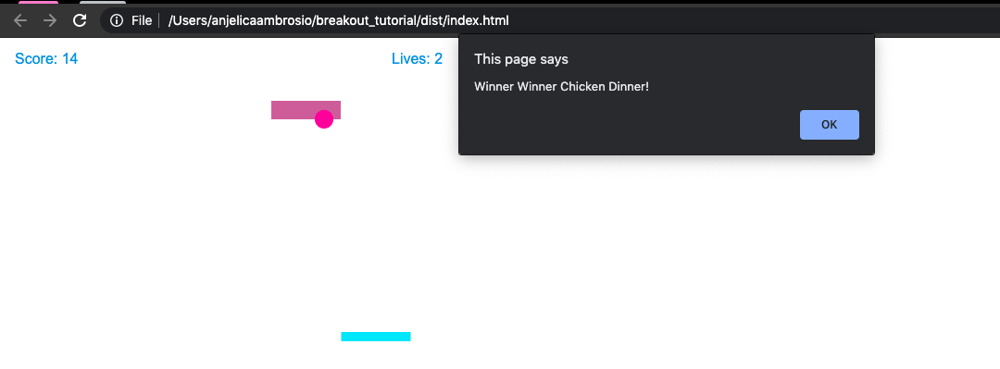

#Breakout Tutorial
by reikamoon :ribbon:

### What is Breakout Tutorial?
Breakout tutorial is a game in which the player uses their mouse to bounce a ball and hit several walls.

### Purpose
I did this tutorial to learn Javascript Fundamentals, and gain a better understanding of how elements like DOM work.

### Screenshots

Gameplay (pink + teal best combo)<br>

 
Victory!

### How to Run Breakout Tutorial
Run the ```index.html```.

### Tools Used
<li> Javascript</li>
<li> Webpack</li>